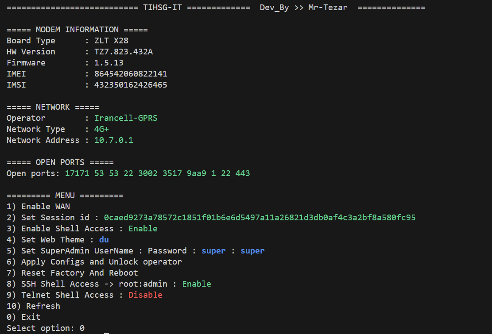

# فریمور ZLT-X28 نسخه 1.5.13 – راهنمای آنلاک (سریع و پیشرفته)



این مخزن شامل **دو روش کامل** برای آنلاک کردن **مودم ZLT-X28 با فریمور 1.5.13** است:

* **روش سریع (Quick)** – اسکریپت اتوماتیک، منویی و مرحله‌به‌مرحله
* **روش پیشرفته (Advanced)** – روش دستی و سطح پایین مخصوص کاربران حرفه‌ای

هیچ بخشی از روش دستی قبلی حذف نشده است.
روش سریع فقط **به عنوان یک گزینه راحت‌تر** به ابتدای راهنما اضافه شده.

---

## 🚀 روش سریع (پیشنهادی)

قبل از اجرای اسکریپت، مطمئن شوید **Python 3** نصب است و کتابخانه‌های موردنیاز را نصب کنید:

```bash
pip install requests
pip install paramiko
```

این روش برای کاربرانی طراحی شده که می‌خواهند **سریع‌ترین و امن‌ترین** آنلاک را با کمترین دردسر انجام دهند.

### ابزار

```
unlock.py
```

اجرای اسکریپت:

```bash
python unlock.py
```

اسکریپت کاملاً تعاملی است و شما را مرحله‌به‌مرحله راهنمایی می‌کند.

---

### 🔧 روند کلی روش سریع

قبل از شروع، باید این دو مورد را **خودتان** آماده کنید:

* **IP مودم**
* **Session ID** (از DevTools مرورگر → تب Network)

اگر Session ID منقضی شود، می‌توانید دوباره داخل اسکریپت آن را وارد کنید.

---

### مراحل منوی اسکریپت

**1) فعال‌سازی WAN**

* حالت WAN را فعال می‌کند
* ⚠️ حتماً **پورت LAN شماره 1 مودم ZLT-X28** را به یک مودم یا روتر دیگر **دارای اینترنت فعال** وصل کنید

**2) تنظیم Session ID**

* در صورت تغییر یا انقضای Session ID، دوباره آن را ست می‌کنید

**3) فعال‌سازی دسترسی شل**

* فعال‌سازی Telnet و SSH از طریق API و Command Injection

**4) تغییر تم وب (اختیاری)**

* تغییر ظاهر پنل وب و لوگو

**5) تنظیم نام کاربری و رمز عبور سوپر ادمین**

مقادیر پیش‌فرض:

```
Username: super
Password: super
```

در این مرحله می‌توانید آن‌ها را تغییر دهید.

**6) اعمال تنظیمات و آنلاک**

* اعمال کامل تنظیمات
* حذف لاک اپراتوری

اگر این مرحله خطا داد:

* مودم را خاموش کنید
* دوباره روشن کنید و مجدداً امتحان کنید

**7) ریست فکتوری**

* ریست فکتوری خودکار و ریبوت مودم

اگر آنلاک باقی نماند:

* ریست فکتوری دستی از پنل وب انجام دهید
* یا دکمه فیزیکی Reset مودم را استفاده کنید

**8) دسترسی شل SSH**

* دسترسی کامل شل روت از طریق SSH

اگر در مرحله 6 یا 8 مشکل داشتید:

* یک بار مودم را از برق بکشید
* دوباره وصل کنید و ادامه دهید

---

## 🧠 روش پیشرفته (دستی / راهنمای اصلی)

این بخش مخصوص **کاربران حرفه‌ای** است که می‌خواهند همه چیز را به صورت دستی و دقیق انجام دهند.

---

## فریمور ZLT-X28 نسخه 1.5.13 + راهنمای آنلاک

این مخزن شامل موارد زیر است:

* **فریمور اصلی ZLT-X28 (نسخه 1.5.13)**
* **اسکریپت آنلاک**

> **تمام فایل‌های موردنیاز، از جمله اسکریپت آنلاک، داخل همین مخزن قرار دارند.**
> نیازی به دانلود از منابع خارجی نیست.

---

## نصب فریمور

1. وارد پنل وب مودم شوید
2. به بخش **System Update** بروید
3. فایل فریمور را آپلود کرده و فرایند آپدیت را شروع کنید
4. بعد از آپدیت، مودم **لاک خواهد شد**

   * این موضوع طبیعی است و در مراحل بعدی رفع می‌شود

---

## گرفتن دسترسی شبکه (IP)

بعد از بوت شدن مودم، باید IP بگیرد. روشش مهم نیست:

* تنظیم WAN
* اتصال به گوشی
* هر منبع شبکه دیگر

مودم فقط باید به اینترنت دسترسی داشته باشد.

---

## فعال‌سازی Telnet / SSH (Command Injection)

قبل از اتصال با SSH یا Telnet، باید از طریق بخش **DMZ / Firewall** یک **Command Injection** انجام دهید.

### مقدار زیر را دقیقاً در فیلد DMZ IP وارد کنید:

```text
192.168.1.1 ; telnetd -l /bin/ash
```

---

## فعال‌سازی از طریق API (لینوکس)

1. ابزار توسعه‌دهنده مرورگر را باز کنید:

   * کلید `F12`
   * تب **Network**
   * مقدار `sessionId` را پیدا و کپی کنید

2. دستور زیر را اجرا کنید و `<session id>` را جایگزین نمایید:

```bash
curl 'https://192.168.70.1/cgi-bin/http.cgi' \
--data-raw '{"enabled":"1","ip":"192.168.1.1 ; telnetd -l /bin/ash","cmd":172,"method":"POST","success":true,"subcmd":6,"token":"5948b69147b3850eee5e7266188934c5","language":"EN","sessionId":"<session id>"}' -k
```

بعد از این مرحله، Telnet و SSH فعال می‌شوند.

---

## دسترسی به دستگاه (SSH)

مشخصات ورود:

* پورت: `22`
* نام کاربری: `admin`
* رمز عبور: `admin`

> این دستگاه از الگوریتم قدیمی `ssh-rsa` استفاده می‌کند.
> باید آن را به صورت دستی در کلاینت SSH مجاز کنید.

```bash
ssh -o HostKeyAlgorithms=+ssh-rsa admin@192.168.70.1
```

---

## آنلاک مودم (روش دستی)

1. **انتقال فایل‌ها با WinSCP**

   * اجرای **WinSCP**
   * Protocol: `SCP`
   * Host: IP مودم (مثلاً `192.168.70.1`)
   * Username: `admin`
   * Password: `admin`
   * Port: `22`

   فایل‌های زیر را به مودم کپی کنید:

   * `x28`
   * `x28.tgz`

   (ترجیحاً داخل مسیر `/tmp`)

2. **اتصال به مودم از طریق SSH**

3. اجرایی کردن اسکریپت:

```bash
chmod +x x28
```

4. اجرای اسکریپت آنلاک:

```bash
sh x28
```

5. مودم به صورت خودکار ریبوت می‌شود

6. بعد از بالا آمدن، **یک بار ریست فکتوری** انجام دهید

تمام.

---

## 📌 ویدیو آموزشی

📌 [https://youtu.be/fveMqGHRkNQ?si=9anquYVuSWbdtyN2](https://youtu.be/fveMqGHRkNQ?si=9anquYVuSWbdtyN2)

---

## ⚠️ نکات پایانی

* مراحل را دقیق و به ترتیب انجام دهید
* وجود اینترنت روی WAN الزامی است
* ریست فکتوری مرحله حیاتی است

اگر آنلاک باقی نماند، تقریباً همیشه یکی از این دو مورد جا افتاده:

* ریست فکتوری انجام نشده
* Session ID منقضی شده
